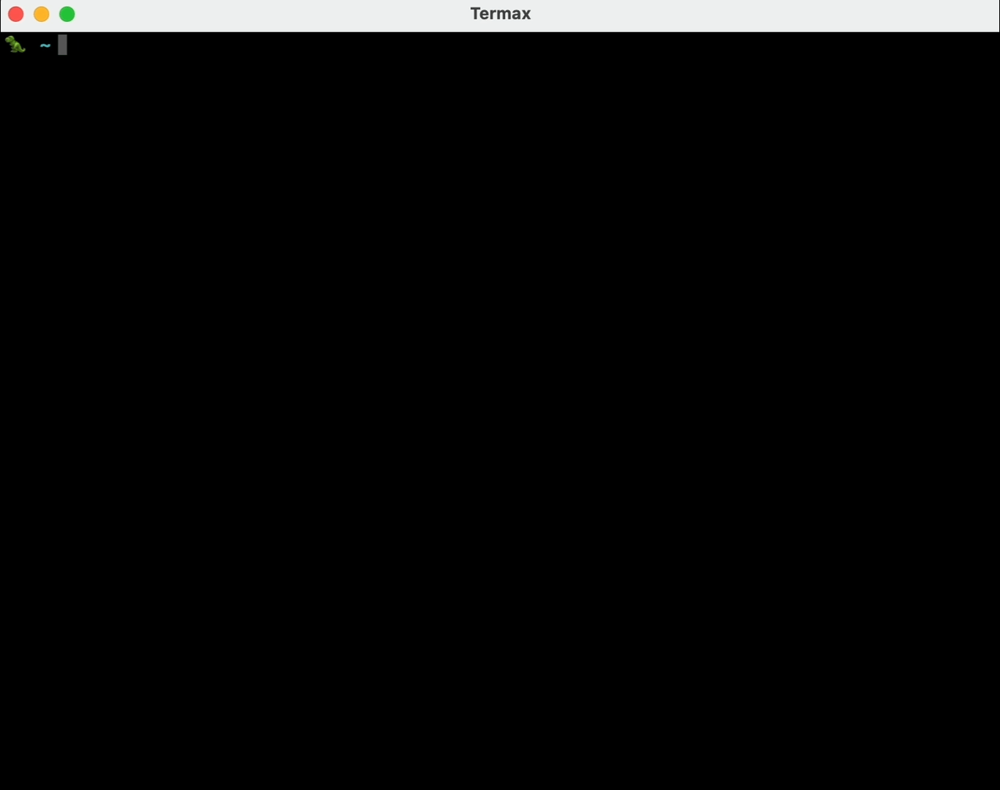

# Termax

   
  


Termax is an LLM agent in your terminal that converts natural language to commands.

<br/>
<p align="center"> 

It is featured by:

- 🍼 Personalized Experience: Optimize the command generation with RAG.
- 📐 Supports various LLMs: OpenAI GPT, Anthropic Claude, Google Gemini, Mistral AI, and more. 
- 🧩 Shell Extensions: Plugin with popular shells like `zsh`, `bash` and `fish`.

## Installation

```bash
pip install termax
```

## Quick Start

After installation, you'll need to configure the LLM. A setup guide will automatically launch the first time you use Termax. Alternatively, you can manually initiate configuration at any time by running `t config` or `termax config`.

#### Ask Commands

You can start using Termax by asking using command `t` or `termax`:

```bash
t show me the top-5 CPU processes
```



#### Guess Commands (experimental)

Termax can predict your next move based on your command history—just try t guess or termax guess to generate a suggested command. It's not only smart, it's fun!

```bash
t guess
```

## Shell Plugin

We support various shells like `bash`, `zsh` and `fish`. You can choose to install the plugins by

```bash
t install -n <plugin>
```

The `<plugin>` can be any of `zsh`, `bash`, or `fish`. With this plugin, you can directly convert natural language into commands using the Ctrl + K shortcut.


You can also easily uninstall the plugin by

```bash
t uninstall -n <plugin>
```

Remember to source your shell or restart it after installing or uninstalling plugins to apply changes.


## Contributing 

For developers, you can install from source code to enable the latest features and bug fixes.

```bash:
cd <root of this project>
pip install -e .
```

## License

Licensed under the [Apache License, Version 2.0](LICENSE).


